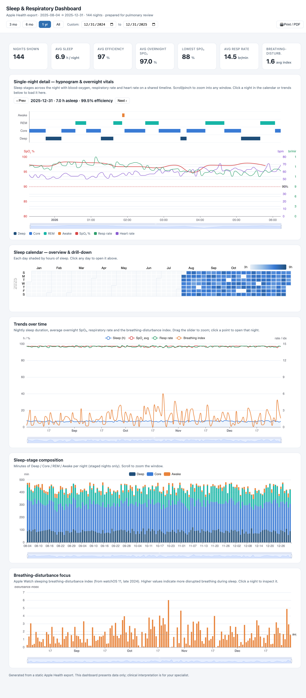

# apple_health_tracker

Tooling to turn an **Apple Health export** into a self-contained, interactive
**sleep & respiratory dashboard** — designed for review with a pulmonary specialist.
It pairs sleep-stage data (hypnogram) with the breathing-related metrics in the export
(blood oxygen / SpO₂, respiratory rate, and Apple's sleeping breathing-disturbance index).

> **Privacy:** this repository contains **code only**. No personal health data is
> included. The raw export and the generated dashboard (which embed real readings) are
> git-ignored and never leave your machine.



*Screenshot above is generated from **synthetic** data (`dashboard/sample_data.py`), not real readings.*

## Quick start

1. On your iPhone: **Health app → profile → Export All Health Data**. Unzip it; you'll
   get a folder containing `export.xml`.
2. Send the file to your destination of choice (AirDrop to a Mac, email to yourself, probably don't save your personal health data to the cloud). Note: depending upon how many years you've been collecting data, it could be multiple gigabytes in size.
3. Place this repo's `dashboard/` folder next to that `export.xml` (or pass a path).
4. Open a command line environment (Terminal, Command) and build the dashboard:
   ```bash
   cd dashboard
   python3 etl.py        # streams ../export.xml -> data/*.json   (a few minutes)
   python3 build.py      # inlines ECharts + data -> sleep-dashboard.html
   ```
5. Double-click the resulting **`dashboard/sleep-dashboard.html`** to open it in a browser. It's one self-contained
   file — no server or internet needed — and has a **Print / PDF** button for sharing.

## Dashboard views

- **Single-night detail** — hypnogram (Deep/Core/REM/Awake) with SpO₂ (incl. a 90%
  threshold line), respiratory rate and heart rate overlaid on a shared, zoomable timeline.
- **Sleep calendar** — every night shaded by hours slept; click a day to open it.
- **Trends** — nightly sleep, avg SpO₂, respiratory rate and breathing-disturbance index.
- **Stage composition** — stacked stage-minutes per night.
- **Breathing-disturbance focus** — the watchOS 11 apnea-related signal over time.

See [`dashboard/README.md`](dashboard/README.md) for details.

## Try it without an export (synthetic demo)

No Apple Health export handy? Generate a realistic, fully synthetic dashboard:

```bash
cd dashboard
python3 sample_data.py                                  # -> ../docs/sample_*.json
python3 build.py ../docs/sample_summary.json ../docs/sample_detail.json /tmp/demo.html
open /tmp/demo.html
```

This is exactly how the screenshot above was produced — no real data involved.

## How it works

`etl.py` stream-parses the multi-GB `export.xml` with constant memory, groups sleep
records into nights (noon-to-noon), deduplicates overlapping sources (prefers Apple
Watch staged data), bins overnight vitals, and emits compact JSON. `build.py` inlines
[Apache ECharts](https://echarts.apache.org/) and that JSON into a single portable HTML.

## License

[MIT](LICENSE) © 2026 Vendaface. Bundled Apache ECharts (`dashboard/vendor/`) is under
the Apache-2.0 license.
